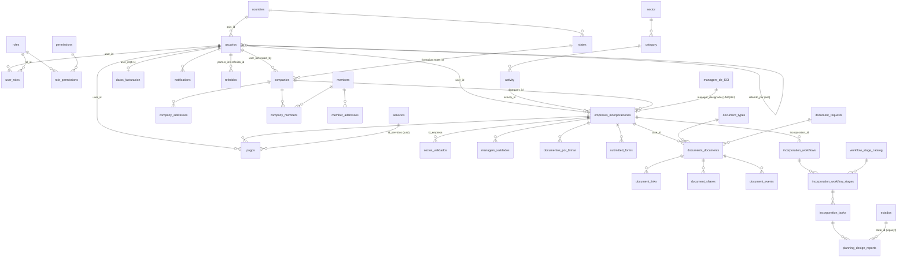
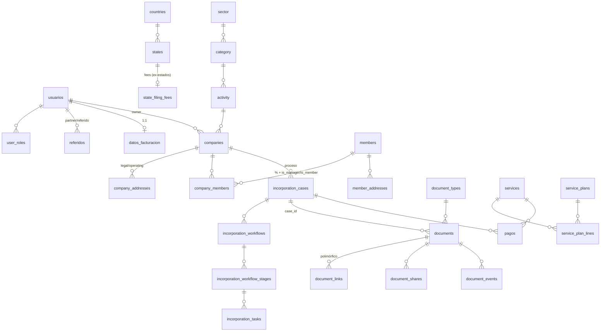

# Reporte de Schema, Entidades y Normalización — Base de Datos Supabase

**Proyecto:** DASHBOARD-TEST (`ceuofnjslxjoqtqxbfqt`) · Postgres 17.4
**Fecha:** 2026-06-10
**Método:** Inspección de `information_schema`/`pg_stat_user_tables` (tablas, columnas, PK/FK, conteo de filas), advisors de Supabase (security + performance) y cruce contra el uso real en el código (`.from('…')` en `src/`).

---

## 1. Resumen ejecutivo

La base de datos contiene **dos generaciones de modelo conviviendo**: un modelo legacy en español (`empresa`, `empresas_incorporaciones`, `servicios`, `socios_validados`, `estados`, …) y un modelo nuevo en inglés repartido en schemas dedicados (`public.companies/members`, `documents.*`, `workflow.*`, `meetings.*`, `catalogs.*`). Esto produce:

- **9 grupos de entidades duplicadas** (empresa ×3, servicios ×6, estados ×2, actividades ×3, socios ×2, workflow ×2, documentos ×2, referidos ×2, planes ×2).
- **Violaciones de 1NF/2NF/3NF concentradas en el modelo legacy**: arrays multivaluados (`usuarios.empresa_id`), grupos repetidos (`nombre_1..3`), hechos duplicados en columnas texto + FK (`actividad` vs `activity_id`), países/estados como texto libre, dinero en `double precision`, fechas y booleanos en `text`.
- **Defectos de integridad**: junction `usuarios_empresas` con PK incorrecta, `orders.service_plan_id` con tipo incompatible y sin FK, `orders.payment_id` sin FK, UNIQUE erróneo en `empresas_incorporaciones.manager_designado_por_SCI`.
- **1 bug activo**: `api/billing/upsert-invoice.ts` inserta en la tabla `facturacion`, que **no existe** (la real es `datos_facturacion`) — el endpoint falla siempre.
- **Higiene**: 72 FKs sin índice, 9 tablas con RLS activado pero sin policies (inaccesibles vía API), 5 policies always-true que anulan RLS, 2 índices duplicados, 32 índices sin uso.

La tabla `empresas_incorporaciones` (36 columnas) es el **punto crítico**: actúa como "god table" y, además, los módulos nuevos (`documents.*`, `workflow.*`) dependen de ella vía `case_id`/`incorporation_id`, por lo que no puede eliminarse sin una migración por fases (ver §8).

---

## 2. Inventario de schemas

| Schema      | Tablas | Rol                                                                            |
| ----------- | ------ | ------------------------------------------------------------------------------ |
| `public`    | 45     | Mezcla: modelo legacy (español) + modelo nuevo (companies/members) + catálogos |
| `documents` | 10     | Módulo nuevo de documentos (activo: 22 docs, 1.068 eventos)                    |
| `workflow`  | 9      | Módulo nuevo de workflow de incorporación (activo: 26 workflows, 451 tasks)    |
| `meetings`  | 2      | Reuniones de planificación (12 meetings, 26 intents)                           |
| `catalogs`  | 1      | `service_plans` (5 filas) — puente a `public.servicios`                        |
| `stripe`    | FDW    | Foreign data wrapper de Stripe (genera`public.wrappers_fdw_stats`)             |

### 2.1 Tablas `public` por estado (filas / uso en código)

**Modelo nuevo (inglés) — activo:**

| Tabla                                                       | Filas         | Uso en código                                            |
| ----------------------------------------------------------- | ------------- | -------------------------------------------------------- |
| `companies`                                                 | 2             | ✔ (company-info, company-records, admin/empresas, rules) |
| `company_addresses`                                         | 3             | ✔ (domains/companies/addresses)                          |
| `company_members`                                           | 3             | ✔ (company-members, rules, schema-registry)              |
| `members`                                                   | 2             | ✔ (members/people, member-addresses, templates)          |
| `member_addresses`                                          | 2             | ✔                                                        |
| `countries` / `states`                                      | 240 / 5.195   | ✔                                                        |
| `activity` / `category` / `sector`                          | 316 / 60 / 19 | ✔ (`activity` directo; `category`/`sector` solo vía FK)  |
| `audit_events`                                              | 44            | ✔                                                        |
| `roles` / `permissions` / `role_permissions` / `user_roles` | 8/4/4/45      | ✔                                                        |
| `notifications`                                             | 122           | ✔                                                        |

**Modelo legacy (español) — aún activo en código:**

| Tabla                                     | Filas  | Uso en código                                                     |
| ----------------------------------------- | ------ | ----------------------------------------------------------------- |
| `usuarios`                                | 31     | ✔ (espejo de`auth.users` + perfil)                                |
| `empresas_incorporaciones`                | 43     | ✔ intensivo (≈30 call sites)                                      |
| `estados`                                 | 51     | ✔ (utils/generals/states, planning, client-form)                  |
| `servicios`                               | 5      | ✔ (services, payment)                                             |
| `micro_servicios`                         | 10     | ✔ (microservices, payment)                                        |
| `servicio_extra`                          | 5      | ✔ (microservices)                                                 |
| `pagos`                                   | 29     | ✔ (payments, admin)                                               |
| `datos_facturacion`                       | 2      | ✔ (users/billing, update-invoice)                                 |
| `documentos_por_firmar`                   | 15     | ✔ (pending-signature, upload-signed, admin)                       |
| `socios_validados` / `managers_validados` | 11 / 2 | ✔ (validated-partners, incorporations/validate)                   |
| `managers_de_SCI`                         | 3      | ~ (solo vía join/FK desde`empresas_incorporaciones`)              |
| `referidos`                               | 0      | ✔ (partners/referrals, dashboard-partners)                        |
| `submitted_forms`                         | 11     | ~ (Dashboard.astro; FK desde`incorporation_workflow`)             |
| `formularios`                             | 4      | ✖ sin`.from()` tras la eliminación de SurveyJS (commit `3459bd9`) |
| `incorporation_workflow` (singular)       | 2      | ~ (1 sola referencia en admin/incorporations.ts)                  |
| `documentos_usuarios`                     | 0      | ✔ (contrato de partners)                                          |
| `empresa` / `empresa_settings`            | 3 / 3  | ~ (1 transformer + api/companies/create)                          |

**Sin uso en código (candidatas a depuración, ver §7):**

| Tabla                                               | Filas       | Nota                                                 |
| --------------------------------------------------- | ----------- | ---------------------------------------------------- |
| `actividades_duplicado`                             | 330         | El nombre lo dice: duplicado de`activity`            |
| `usuarios_empresas`                                 | 0           | Junction rota (PK = solo`empresa_id`)                |
|                                                     |             |                                                      |
| `naics_sectors` / `naics_subsectors`                | 2 / 2       | Jerarquía NAICS paralela a`sector/category/activity` |
| `orders` / `order_lines`                            | 0 / 0       | Modelo futuro de órdenes, sin policies RLS           |
| `services` / `service_plans` / `service_plan_lines` | 10 / 4 / 10 | Catálogo nuevo sin consumo; RLS sin policies         |
| `wrappers_fdw_stats`                                | 1           | Interna del FDW de Stripe; RLS deshabilitado         |

---

## 3. Diagrama de relaciones (núcleo actual)

**Observación clave:** los módulos nuevos `documents.*` y `workflow.*` cuelgan de `empresas_incorporaciones` (legacy) como entidad "case", y `workflow.planning_design_reports.state_id` referencia la tabla legacy `estados` en lugar de `states`. La entidad legacy es hoy el hub del sistema.

---

## 4. Entidades duplicadas (redundancia entre tablas)

| #   | Concepto                      | Tablas que lo representan                                                                                                     | Evidencia                                                                                                         | Consolidar en                                                                                          |
| --- | ----------------------------- | ----------------------------------------------------------------------------------------------------------------------------- | ----------------------------------------------------------------------------------------------------------------- | ------------------------------------------------------------------------------------------------------ |
| 1   | **Empresa**                   | `empresa` (3) · `companies` (2) · `empresas_incorporaciones` (43, mezcla empresa+caso) · `usuarios.empresa_id[]`              | 4 representaciones del mismo concepto                                                                             | `companies` (entidad) + caso de incorporación en `workflow`                                            |
| 2   | **Estado/Provincia**          | `estados` (51, solo EE.UU. + fees) · `states` (5.195, global, FK a `countries`)                                               | Nombres de estado duplicados en ambas                                                                             | `states` + nueva tabla `state_filing_fees` con los datos económicos de `estados`                       |
| 3   | **Actividad económica**       | `actividades_duplicado` (330) · `sector→category→activity` (IRS) · `naics_sectors/naics_subsectors`                           | 3 jerarquías paralelas; además`empresas_incorporaciones.actividad` (texto)                                        | `sector→category→activity`; NAICS como columnas/atributos si se necesita                               |
| 4   | **Servicio (catálogo)**       | `servicios` (5) · `micro_servicios` (10, estructura idéntica) · `servicio_extra` (5) · `services` (10, sin uso)               | `servicios` y `micro_servicios` comparten 9 columnas (nombre, precio, categoria, descripcion, etiqueta, odoo\_\*) | Una sola`services` con columna `kind`/`category_id`                                                    |
| 5   | **Plan de servicios**         | `public.service_plans` (uuid, 4) · `catalogs.service_plans` (int, 5, FK desde `workflow`)                                     | Dos tablas con el mismo nombre en schemas distintos y tipos de PK incompatibles                                   | Una sola (la que referencia`workflow.workflow_stage_plan_applicability`)                               |
| 6   | **Socio/Miembro**             | `socios_validados` (11, todo texto) · `managers_validados` (2, todo texto) · `members`+`company_members` (tipado, enums, FKs) | Mismos hechos (nombre, pasaporte, SSN/ITIN, nacionalidad, %) en texto plano vs modelo relacional                  | `members` + `company_members` + `member_addresses`                                                     |
| 7   | **Workflow de incorporación** | `public.incorporation_workflow` (2, singular) · `workflow.incorporation_workflows` + stages + tasks (26/190/451)              | El legacy quedó casi huérfano (1 call site)                                                                       | Schema`workflow`                                                                                       |
| 8   | **Documento**                 | `documentos_usuarios` (0) · `documentos_por_firmar` (15) · `documents.documents` (22) + tipos/links/shares/events             | 3 modelos; el nuevo ya registra eventos y shares                                                                  | Schema`documents` (firmas → `document_requests`/`status`)                                              |
| 9   | **Referido**                  | `referidos` (tabla con code/source) · `usuarios.referido_por` (self-FK)                                                       | El mismo hecho ("X fue referido por Y") en dos lugares → anomalía de actualización                                | `referidos` (conserva metadata); `usuarios.referido_por` se elimina o se vuelve columna generada/vista |

---

## 5. Violaciones de normalización

### 5.1 Primera Forma Normal (atributos multivaluados / grupos repetidos)

| Tabla.columna                                                                                                                            | Problema                                                                                           | Corrección                                                                                                                                                           |
| ---------------------------------------------------------------------------------------------------------------------------------------- | -------------------------------------------------------------------------------------------------- | -------------------------------------------------------------------------------------------------------------------------------------------------------------------- |
| `usuarios.empresa_id ARRAY`                                                                                                              | Lista de empresas dentro del usuario. Existe la junction`usuarios_empresas` pero está vacía y rota | M:N vía`company_members` o `usuarios_empresas` con PK compuesta                                                                                                      |
| `empresas_incorporaciones.nombre_1, nombre_2, nombre_3`                                                                                  | Grupo repetido clásico (opciones de nombre)                                                        | Tabla hija`incorporation_name_options(incorporation_id, position, name)` — `workflow.incorporation_workflows.possible_names` ya intenta esto pero también como ARRAY |
| `socios_validados.roles ARRAY`                                                                                                           | Roles multivaluados en texto                                                                       | Flags tipados como en`company_members.is_member/is_manager`                                                                                                          |
| `empresas_incorporaciones.informacion_miembros text`                                                                                     | Estructura serializada en texto plano                                                              | Filas en`company_members`                                                                                                                                            |
| `managers_validados.Pais_de_nacionalidad_manager` + `Pais_de_nacionalidad_manager_2`                                                     | Grupo repetido (doble nacionalidad en 2 columnas)                                                  | Tabla`member_nationalities(member_id, country_id)` o quedarse con la principal                                                                                       |
| `formularios.schema_json`, `submitted_forms.data_json/schema_snapshot/respuestas_validadas`, `orders.metadata`, `empresa_settings.theme` | JSON embebido                                                                                      | Aceptable para formularios dinámicos/snapshots;**no** usarlo para hechos consultables (p. ej. respuestas validadas que luego se filtran)                             |

### 5.2 Segunda/Tercera Forma Normal (dependencias y hechos derivados/duplicados)

| Tabla.columna(s)                                                                                                                                                                                          | Problema                                                                        | Corrección                                                                                                           |
| --------------------------------------------------------------------------------------------------------------------------------------------------------------------------------------------------------- | ------------------------------------------------------------------------------- | -------------------------------------------------------------------------------------------------------------------- |
| `members.first_name, last_name, full_name, name`                                                                                                                                                          | 4 columnas de nombre;`full_name`/`name` derivables → riesgo de divergencia      | Conservar`first_name/last_name` (+ `name` para jurídicas); `full_name` como columna generada o en vista              |
| `member_addresses.state_id` (FK) **y** `state` (texto)                                                                                                                                                    | Mismo hecho en dos representaciones                                             | Solo FK; texto libre únicamente cuando`country` no tiene estados catalogados                                         |
| `empresas_incorporaciones.actividad` (texto) + `actividad_no_listada` + `activity_id` (FK) + `activity_description`                                                                                       | El mismo hecho en 4 columnas; dependencia transitiva del nombre de la actividad | `activity_id` + un solo campo libre `activity_other`                                                                 |
| `empresas_incorporaciones.estado_eeuu` (texto) + `state_id` (FK)                                                                                                                                          | Duplicado texto/FK                                                              | Solo`state_id`                                                                                                       |
| `empresas_incorporaciones.direccion_eeuu, direccion_operativa_eeuu, ciudad_eeuu, condado_eeuu, codigo_postal_eeuu, direccion_empresa, Pais_operativo`                                                     | Dirección embebida y repetida (operativa vs legal)                              | `company_addresses` con `type` ('legal'/'operating') — ya existe y soporta esto                                      |
| `socios_validados.pais_de_nacionalidad`, `pais_planilla`, `managers_validados.Pais_de_nacionalidad_manager` (texto)                                                                                       | País como texto libre → imposible garantizar consistencia con`countries`        | FK a`countries` (como ya hace `members.country_*_id`)                                                                |
| `socios_validados.porcentaje text`, `residente_fiscal text`                                                                                                                                               | Numérico y booleano almacenados como texto                                      | `numeric(5,2)` y `boolean` (cf. `company_members.percentage`)                                                        |
| `usuarios.fecha_nacimiento text`                                                                                                                                                                          | Fecha como texto                                                                | `date` (cf. `members.birth_date`)                                                                                    |
| `estados.Fee double precision`, `servicios.precio`, `micro_servicios.precio` (float)                                                                                                                      | Dinero en punto flotante → errores de redondeo                                  | `numeric(12,2)` (cf. `services.price numeric`)                                                                       |
| `estados.FechaLimite text`, `FrecuenciaDePago text`                                                                                                                                                       | Fechas/frecuencias como texto libre                                             | `date`/enum                                                                                                          |
| `services.status text` **y** `is_active text`                                                                                                                                                             | Dos columnas de estado, y un boolean tipado como texto                          | Una sola:`is_active boolean` o enum `status`                                                                         |
| `service_plans.status` + `is_active`                                                                                                                                                                      | Igual que el anterior                                                           | Una sola                                                                                                             |
| `pagos.odoo_sale_order_id` **y** `empresas_incorporaciones.odoo_sale_order_id`                                                                                                                            | Hecho de integración duplicado en dos tablas                                    | Vivir solo en`pagos` (el pago es el que origina la orden Odoo)                                                       |
| `order_lines.service_name, unit_price, subtotal, total`                                                                                                                                                   | `subtotal/total` derivables de `quantity × unit_price`                          | Aceptable**solo** como snapshot de factura; documentarlo o calcular en vista. `service_name` como snapshot es válido |
| `usuarios.referido_por` vs `referidos`                                                                                                                                                                    | Hecho duplicado (ver §4.9)                                                      | Una sola fuente                                                                                                      |
| Status como texto libre:`empresas_incorporaciones.estado/estado_de_incorporacion`, `documentos_por_firmar.status/categoria`, `pagos.status`, `servicio_extra.estado`, `empresa.estado`, `usuarios.estado` | Sin dominio controlado; cada tabla inventa sus valores                          | Enums Postgres (el modelo nuevo ya lo hace:`companies_legal_status`, `document_status`, `workflow_status`, …)        |

### 5.3 Claves e integridad referencial

| Hallazgo                                                                               | Detalle                                                                                                                                                    | Riesgo                                                       |
| -------------------------------------------------------------------------------------- | ---------------------------------------------------------------------------------------------------------------------------------------------------------- | ------------------------------------------------------------ |
| `usuarios_empresas` PK = **solo** `empresa_id`                                         | Una empresa solo puede tener UN usuario; rompe el propósito M:N                                                                                            | Alto si se llega a usar. PK correcta:`(user_id, empresa_id)` |
| `empresas_incorporaciones.manager_designado_por_SCI` UNIQUE                            | Un manager de SCI solo puede asignarse a**una** incorporación en toda la historia                                                                          | Bloqueo funcional al reusar managers                         |
| `orders.service_plan_id bigint` sin FK                                                 | `public.service_plans.id` es **uuid** y `catalogs.service_plans.id` es **integer** → referencia ambigua e imposible de constrainear contra la tabla public | Integridad rota desde el diseño                              |
| `orders.payment_id uuid NOT NULL` sin FK                                               | No referencia`pagos.id_pagos`                                                                                                                              | Huérfanos posibles                                           |
| `servicios`: PK `id bigint` + UNIQUE `id_servicios uuid`                               | Doble identidad; los FKs externos (`pagos.servicio_id`) apuntan al uuid, no a la PK                                                                        | Confusión permanente; elegir una sola clave                  |
| `managers_de_SCI`: PK `id bigint` + UNIQUE `manager_sci_id uuid` (la que usan los FKs) | Igual que el anterior                                                                                                                                      | Ídem                                                         |
| Índices duplicados                                                                     | `micro_servicios` (pkey + unique sobre la misma col), `usuarios` (pkey + `usuarios_user_id_key`)                                                           | Espacio/escritura desperdiciados                             |
| `documents.documents.case_id` → `empresas_incorporaciones`                             | El módulo nuevo depende de la god-table legacy                                                                                                             | Acopla la migración (ver §8)                                 |
| `workflow.planning_design_reports.state_id` → `estados` (legacy)                       | Módulo nuevo apuntando al catálogo viejo                                                                                                                   | Ídem                                                         |
| 72 FKs sin índice de cobertura                                                         | Destacan las muy consultadas:`pagos`, `notifications.user_id`, `empresas_incorporaciones.activity_id/state_id`, `company_members.*`, `documents.*`         | Joins y cascadas lentos                                      |

### 5.4 Bug activo encontrado

[src/pages/api/billing/upsert-invoice.ts:84](src/pages/api/billing/upsert-invoice.ts:84) hace `supabaseAdmin.from('facturacion').insert(...)` — la tabla `facturacion` **no existe en ningún schema** (la real es `datos_facturacion`). El endpoint devuelve siempre `400 Insert failed`. Además su gemelo [update-invoice.ts](src/pages/api/billing/update-invoice.ts) sí usa `datos_facturacion`.

---

## 6. Hallazgos de los advisors (Supabase)

**Seguridad** (1 ERROR, 78 WARN):

- 9 tablas con **RLS activado pero sin policies** (toda query vía API devuelve vacío): `orders`, `order_lines`, `services`, `service_plans`, `service_plan_lines`, `naics_sectors`, `naics_subsectors`, `managers_de_SCI`, `documents.mail_templates`. Confirma que el catálogo nuevo nunca se ha consumido desde la app.
- 5 policies **always-true** que anulan RLS: `empresa` (`insertar`, `actualizar`), `empresa_settings` (`insertar_genral`, `actualizar`), `company_addresses` (`company_addresses_update_accessible` WITH CHECK true), y un SELECT amplio en `storage.objects` para `empresa-logos`.
- `wrappers_fdw_stats` expuesta sin RLS (ERROR).
- 24 funciones SECURITY DEFINER ejecutables por `anon`, 21 funciones con `search_path` mutable, versión de Postgres con parches de seguridad pendientes, protección de contraseñas filtradas desactivada.

**Rendimiento:** 72 FKs sin índice · 48 multiple-permissive-policies · 41 policies que reevaluan `auth.uid()` por fila (`auth_rls_initplan`) · 32 índices nunca usados · 2 índices duplicados.

---

## 7. Plan de depuración (qué eliminar/consolidar y en qué orden)

### Fase 0 — Sin riesgo (no usadas por código y/o vacías)

| Acción         | Objeto                                                                                   | Justificación                                                                                                                                                               |
| -------------- | ---------------------------------------------------------------------------------------- | --------------------------------------------------------------------------------------------------------------------------------------------------------------------------- |
| DROP           | `actividades_duplicado`                                                                  | 0 referencias; duplicado declarado de`activity`                                                                                                                             |
| DROP           | `usuarios_empresas`                                                                      | 0 filas, 0 referencias, PK rota                                                                                                                                             |
| DROP           | `naics_sectors`, `naics_subsectors`                                                      | 2 filas c/u, 0 referencias; jerarquía IRS ya cubre el caso                                                                                                                  |
| DROP o adoptar | `orders`, `order_lines`, `public.services`, `public.service_plans`, `service_plan_lines` | 0 consumo; si son el modelo futuro, corregir primero §5.3 (tipos/FKs) y crear policies                                                                                      |
| DROP INDEX     | `micro_servicios_id_micro_servicios_key`, `usuarios_user_id_key`                         | Duplicados exactos de la PK                                                                                                                                                 |
| Fix            | `api/billing/upsert-invoice.ts` → `datos_facturacion`                                    | Bug activo                                                                                                                                                                  |
| Decidir        | `formularios` + `submitted_forms`                                                        | SurveyJS fue eliminado (commit`3459bd9`); `incorporation_workflow.submitted_form_id` aún la referencia — si se elimina el legacy workflow (Fase 1), pueden archivarse ambas |

### Fase 1 — Consolidaciones de bajo riesgo

1. **Workflow legacy:** migrar las 2 filas de `public.incorporation_workflow` a `workflow.incorporation_workflows` y eliminar la tabla (solo 1 call site: [src/domains/admin/incorporations.ts](src/domains/admin/incorporations.ts)).
2. **Referidos:** elegir `referidos` como fuente única (tiene `code`/`source`); backfillear desde `usuarios.referido_por` y eliminar esa columna (o mantenerla como vista).
3. **`managers_de_SCI`:** quedarse con una sola clave (`manager_sci_id` uuid como PK), y **eliminar el UNIQUE** sobre `empresas_incorporaciones.manager_designado_por_SCI`.
4. **Catálogo de servicios:** unificar `servicios` + `micro_servicios` + `servicio_extra` en una tabla `services` con `kind` ('plan'|'micro'|'extra'), `price numeric(12,2)`, `category_id` FK y claves Odoo. Actualizar `pagos.servicio_id` para apuntar a la nueva PK.
5. **Planes:** dejar **una** tabla de planes (la de `catalogs` es la única referenciada por FK desde `workflow`); mover líneas/precios ahí y eliminar la otra.
6. **Estados:** crear `state_filing_fees(state_id FK→states, fee numeric, payment_frequency, due_rule, notes)` con los datos de `estados`, repuntar `planning_design_reports.state_id` y los consumos de código (`domains/utils/generals/states.ts`, client-form, planning) a `states`, y retirar `estados`.

### Fase 2 — Migración de personas (socios/managers → members)

1. Backfill: `socios_validados` y `managers_validados` → `members` (+ `company_members` con `percentage`, `is_manager`, `is_member`; países resueltos contra `countries`).
2. Actualizar [api/incorporations/validate.ts](src/pages/api/incorporations/validate.ts) y [domains/companies/validated-partners.ts](src/domains/companies/validated-partners.ts) para leer/escribir el modelo nuevo.
3. Retirar `socios_validados`/`managers_validados` cuando operaciones valide paridad.

### Fase 3 — Partir la god-table `empresas_incorporaciones`

Separar sus 3 responsabilidades (requiere coordinación porque `documents.*`, `workflow.*`, `pagos`, `submitted_forms`, `socios/managers_validados` cuelgan de ella):

- **Empresa** (hecho permanente) → `companies` (+ `company_addresses` para las direcciones inline, + `activity_id`).
- **Caso de incorporación** (proceso) → `workflow.incorporation_workflows` (+ `possible_names` normalizado, progreso, flags de manager).
- **Integración Odoo** → queda en `pagos`.

Estrategia recomendada: congelar la tabla como `incorporation_cases` (solo columnas de caso: `user_id`, `company_id`, estado, fechas), mover el resto, y mantener una **vista de compatibilidad** con el nombre viejo mientras se repuntan los ~30 call sites.

### Fase 4 — Documentos legacy

- `documentos_por_firmar` → `documents.documents` (status `pending` + `document_requests` para la solicitud de firma); ya existe el enum `document_status` y la categoría `signature` en `document_relation_purpose`.
- `documentos_usuarios` (0 filas) → eliminar tras repuntar el contrato de partners ([api/partners/contract.ts](src/pages/api/partners/contract.ts)) a `documents` con `related_to_type='user'`.
- `empresa`/`empresa_settings` → los logos/temas pasan a `companies` o a una `company_settings` 1:1 con `companies`; eliminar las policies always-true al retirarlas.

### Transversal (cualquier fase)

- Índices sobre los 72 FKs sin cobertura (priorizar `pagos`, `notifications`, `empresas_incorporaciones`, `documents.*`, `company_members`).
- Policies RLS para las tablas que queden con RLS-sin-policy; reemplazar las always-true por predicados de ownership.
- `auth.uid()` envuelto en `(select auth.uid())` en las 41 policies señaladas; consolidar las 48 permissive duplicadas.
- Tipos: dinero → `numeric(12,2)`; fechas → `date/timestamptz`; booleanos → `boolean`; status → enums.
- Convención: todo lo nuevo en inglés y en su schema de dominio (`documents`, `workflow`, `meetings`, `catalogs`), siguiendo el patrón ya establecido.

---

## 8. Modelo objetivo (resumen)

Principios: una tabla por entidad, hechos una sola vez (texto libre nunca convive con FK del mismo hecho), catálogos únicos (`countries/states/activity/services`), procesos separados de entidades (caso ≠ empresa), enums para estados, dinero en `numeric`, M:N siempre con PK compuesta.
